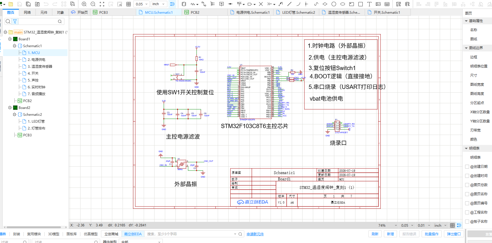
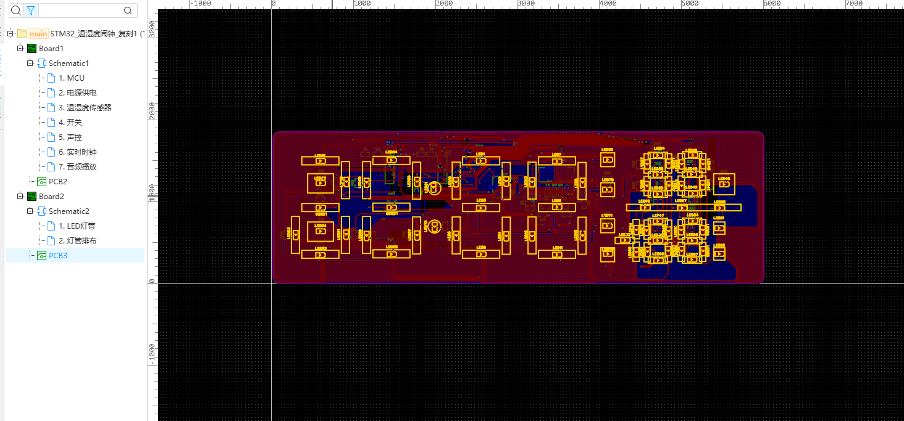

# 温湿度闹钟复刻

<p align="center">
  
  
</p>

这是一个基于 STM32F103C8T6 的温湿度闹钟复刻项目，包含数码管显示、DHT11 温湿度采集、DS1302Z 实时时钟、NV020D 语音提醒、按键/触摸输入和 EasyEDA 硬件工程。

## 项目内容

- 主控：STM32F103C8T6，72 MHz，HAL + FreeRTOS。
- 显示：两块板上的分时复用 LED/数码管显示，支持时间、温度、湿度、闹钟和亮度提示。
- 传感器：DHT11，读取整数温度和湿度。
- 实时时钟：DS1302Z，使用 32.768 kHz 晶振和备用电池。
- 语音：NV020D，一线控制发送播放、音量、循环和停止命令。
- 工具链：STM32CubeMX 生成初始化代码，Keil MDK-ARM/ARMCC 编译。

实物效果：


## 硬件文件

嘉立创 EDA 工程在 [hardware/温湿度闹钟.epro2](hardware/温湿度闹钟.epro2)。工程内包含主控板、灯板、原理图页和 PCB 数据。

更多截图：

| 内容 | 文件 |
| --- | --- |
| 主控与时钟原理图 | [schematic-mcu.png](docs/images/schematic-mcu.png) |
| 灯板原理图 | [schematic-led.png](docs/images/schematic-led.png) |
| PCB 布局 | [pcb-layout.png](docs/images/pcb-layout.png) |
| PCB 铜箔视图 | [pcb-copper.png](docs/images/pcb-copper.png) |

## 代码结构与文件作用

代码根目录为 [温湿度闹钟全代码](温湿度闹钟全代码)。应用代码和硬件接口分开，便于替换传感器或显示驱动。

| 目录/文件 | 作用 |
| --- | --- |
| `P01_CLOCK_HAL.ioc` | STM32CubeMX 外设、时钟和 GPIO 配置源文件。 |
| `Core/Inc/main.h` | 芯片型号、GPIO 引脚宏和公共声明；硬件引脚改动优先看这里。 |
| `Core/Src/main.c` | HAL 初始化、系统时钟配置和 FreeRTOS 启动入口。 |
| `Core/Src/gpio.c` | GPIO 端口时钟、初始电平和输入/输出模式配置。 |
| `Core/Src/usart.c` | USART1 初始化，供调试日志输出使用。 |
| `Core/Src/stm32f1xx_it.c` | STM32F1 中断服务函数（CubeMX 生成）。 |
| `Core/Src/stm32f1xx_hal_msp.c` | HAL 外设底层 MSP 初始化（CubeMX 生成）。 |
| `Core/Src/system_stm32f1xx.c` | CMSIS 系统初始化和时钟变量。 |
| `MDK-ARM/application/App_freeRTOS.c` | 创建采集、显示、按键、闹钟、音量五个任务，并维护共享状态。 |
| `MDK-ARM/application/App_dateTime.c` | DS1302Z 日历读写、BCD 转换和星期计算。 |
| `MDK-ARM/application/App_show.c` | 正常显示、时间设置和闹钟设置页面逻辑。 |
| `MDK-ARM/application/App_switch.c` | 按键、拨动开关和页面切换处理。 |
| `MDK-ARM/interface/Inf_dht11.c` | DHT11 起始信号、40 bit 接收、超时和校验。 |
| `MDK-ARM/interface/Inf_DS1302Z.c` | DS1302Z 三线串行读写和微秒级延时。 |
| `MDK-ARM/interface/Inf_nv020d.c` | NV020D 一线命令、音量和停止控制。 |
| `MDK-ARM/interface/Inf_led.c` | LED 驱动串行移位、分时点亮和数字编码。 |
| `MDK-ARM/interface/Inf_key.c` | 按键消抖、短按/长按和开关状态读取。 |
| `MDK-ARM/interface/Inf_touch.c` | 触摸输入读取。 |
| `MDK-ARM/interface/Inf_mic.c` | 麦克风输入状态读取。 |
| `MDK-ARM/common/Com_debug.c/.h` | USART1 的 `printf` 重定向和可开关调试日志。 |
| `MDK-ARM/freeRTOS/` | FreeRTOS 内核及移植层，保留上游许可证和版权声明。 |
| `Drivers/CMSIS/` | ARM CMSIS 与 STM32F1 设备头文件，保留上游许可证。 |
| `Drivers/STM32F1xx_HAL_Driver/` | ST 官方 HAL 驱动，保留 ST 许可证声明。 |
| `MDK-ARM/P01_CLOCK_HAL.uvprojx` | Keil MDK 工程文件。 |

构建输出（`*.o`、`*.d`、`*.crf`、`*.axf`、`*.hex`、`*.map`、`build/` 等）已加入 `.gitignore`，不会作为源码的一部分提交。

## 三款芯片的时序与读写顺序

### DHT11

DHT11 是单总线、主机发起的读操作，没有寄存器写入。完整顺序是：

```text
空闲高电平
→ STM32 拉低 DATA ≥18 ms
→ 释放 DATA，等待约 20～40 µs
→ DHT11 应答：低约 80 µs，再高约 80 µs
→ 接收 40 bit：每 bit 先低约 50 µs，再用高电平宽度区分 0/1
→ 5 字节校验：RH_int、RH_dec、T_int、T_dec、checksum
→ checksum = (byte0 + byte1 + byte2 + byte3) & 0xFF
→ 两次采样至少间隔 2 s
```

细节和图示见 [docs/protocols/dht11.md](docs/protocols/dht11.md)。

### DS1302Z

DS1302Z 是 CE/SCLK/I/O 三线串行 RTC，命令和数据均为 LSB first：

```text
读：CE=0、SCLK=0 → CE=1 → 发送读命令（bit0→bit7）
   → STM32 释放 I/O → 产生 8 个时钟并在下降沿读取 bit0→bit7 → CE=0

写：CE=0、SCLK=0 → CE=1 → 发送写命令（bit0→bit7）
   → 发送数据（bit0→bit7） → CE=0
```

RTC 首次设置通常先写 `0x8E=0x00` 清除 WP，再按秒、分、时、日、月、星期、年写入 BCD，最后写 `0x8E=0x80` 恢复写保护。详见 [docs/protocols/ds1302z.md](docs/protocols/ds1302z.md)。

### NV020D

本工程使用 NV020D 一线控制方式。它是“只写命令”的语音控制接口，不像 DS1302Z 那样读回寄存器：

```text
DATA 空闲高电平
→ DATA 拉低约 4～5 ms
→ 命令按 bit0→bit7 发送
→ 发送 0：高约 1 ms、低约 3 ms
→ 发送 1：高约 3 ms、低约 1 ms
→ DATA 恢复高电平，等待芯片处理
```

常用命令：`0x00` 播放第 1 段，`0xE0`～`0xE7` 设置 8 级音量，`0xFE` 停止播放。连码、二线模式和 BUSY 时序见 [docs/protocols/nv020d.md](docs/protocols/nv020d.md)。

## 编译与使用

1. 安装 Keil MDK-ARM 5.x，并准备 ARMCC 5 工具链（原工程记录的版本为 MDK 5.24 / ARMCC 5.06 update 5）。
2. 打开 `温湿度闹钟全代码/MDK-ARM/P01_CLOCK_HAL.uvprojx`。
3. 选择 `P01_CLOCK_HAL` target，编译并下载到 STM32F103C8T6。
4. USART1 使用 115200-8-N-1，可观察调试日志。

原工程附带的历史构建日志记录为 `0 Error(s), 0 Warning(s)`；本次整理环境没有安装 UV4/ARMCC，因此没有在当前机器重新生成固件。下载前建议在本机 Keil 中执行一次 Rebuild。

## 修改说明

本次整理保持应用接口不变，主要改动包括：

- DHT11 增加边沿等待超时，并确保所有异常路径都会退出 FreeRTOS 临界区。
- DS1302Z 写事务结束时明确拉低 CE/RST；日历读写统一用 BCD 和 24 小时制。
- NV020D 将脉宽参数集中为常量，命令发送按 bit0→bit7 实现。
- FreeRTOS 延时统一使用 `pdMS_TO_TICKS()`，修正音量下调的无符号数下溢，并避免关闭 LED 时任务空转。
- 删除废弃的整段协议实现和调试占位输出，补充了模块边界和关键时序注释。

## 许可证

本仓库中项目原创部分采用 MIT 许可证，见 [LICENSE](LICENSE)。`Drivers/` 和 `MDK-ARM/freeRTOS/` 目录包含 ST、Arm 和 Amazon FreeRTOS 的第三方代码，具体声明见 [THIRD_PARTY_NOTICES.md](THIRD_PARTY_NOTICES.md)；使用或再分发时请同时遵守对应上游许可证。
