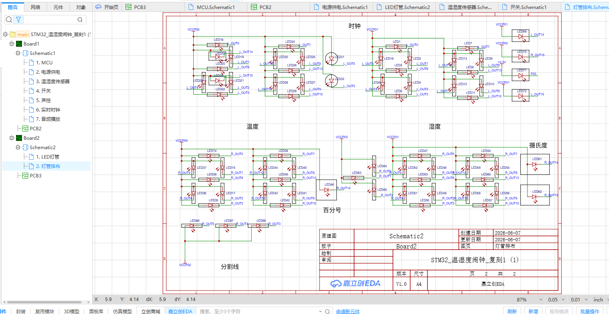
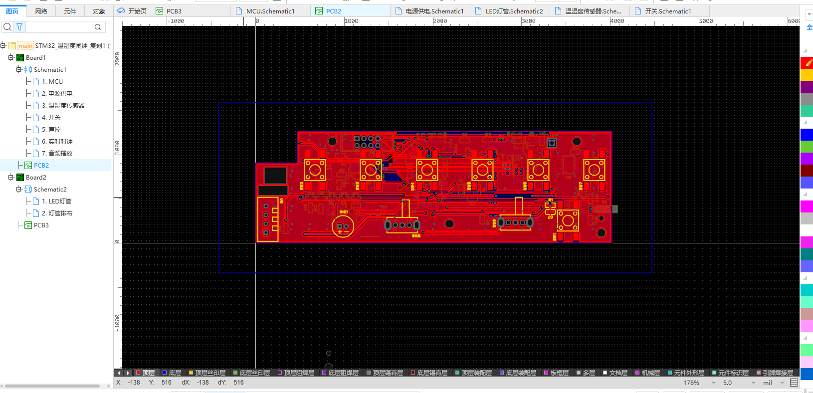
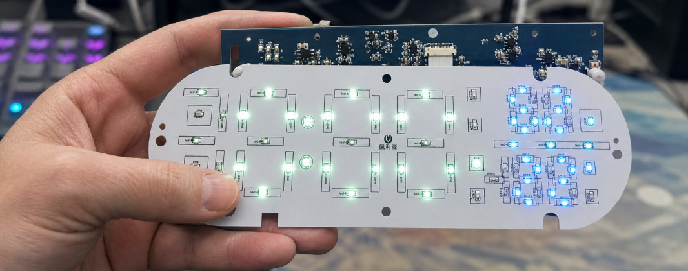

# 温湿度闹钟复刻

<p align="center">
  
  
</p>
<p align="center">
  
  
</p>

这是一个基于 STM32F103C8T6 的温湿度闹钟复刻项目，包含数码管显示、DHT11 温湿度采集、DS1302Z 实时时钟、NV020D 语音提醒以及按键/触摸输入。

## 项目内容

- 主控：STM32F103C8T6，72 MHz，HAL + FreeRTOS。
- 显示：两块板上的分时复用 LED/数码管显示，支持时间、温度、湿度、闹钟和亮度提示。
- 传感器：DHT11，读取整数温度和湿度。
- 实时时钟：DS1302Z，使用 32.768 kHz 晶振和备用电池。
- 语音：NV020D，一线控制发送播放、音量、循环和停止命令。

实物效果：



## 代码结构与文件作用

代码根目录为 [software](software)。下面只列出本项目编写的应用层和接口层代码。

| 目录/文件 | 作用 |
| --- | --- |
| `software/MDK-ARM/application/App_freeRTOS.c` | 创建采集、显示、按键、闹钟、音量五个任务，并维护共享状态。 |
| `software/MDK-ARM/application/App_dateTime.c` | DS1302Z 日历读写、BCD 转换和星期计算。 |
| `software/MDK-ARM/application/App_show.c` | 正常显示、时间设置和闹钟设置页面逻辑。 |
| `software/MDK-ARM/application/App_switch.c` | 按键、拨动开关和页面切换处理。 |
| `software/MDK-ARM/interface/Inf_dht11.c` | DHT11 起始信号、40 bit 接收、超时和校验。 |
| `software/MDK-ARM/interface/Inf_DS1302Z.c` | DS1302Z 三线串行读写和微秒级延时。 |
| `software/MDK-ARM/interface/Inf_nv020d.c` | NV020D 一线命令、音量和停止控制。 |
| `software/MDK-ARM/interface/Inf_led.c` | LED 驱动串行移位、分时点亮和数字编码。 |
| `software/MDK-ARM/interface/Inf_key.c` | 按键消抖、短按/长按和开关状态读取。 |
| `software/MDK-ARM/interface/Inf_touch.c` | 触摸输入读取。 |
| `software/MDK-ARM/interface/Inf_mic.c` | 麦克风输入状态读取。 |
| `software/MDK-ARM/common/Com_debug.c/.h` | USART1 的 `printf` 重定向和可开关调试日志。 |

## 开源文件夹说明

| 文件夹 | 作用 |
| --- | --- |
| `software/MDK-ARM/application/` | 闹钟状态、页面显示和 FreeRTOS 任务代码。 |
| `software/MDK-ARM/interface/` | 传感器、时钟、语音、LED、按键和输入接口代码。 |
| `software/MDK-ARM/common/` | 调试输出封装。 |

## 三款芯片的时序与读写顺序

### DHT11

DHT11 是单总线、主机发起的读操作，没有寄存器写入。完整顺序是：

```text
空闲高电平
→ STM32 拉低 DATA ≥18 ms
→ 释放 DATA，等待约 20～40 µs
→ DHT11 应答：低约 80 µs，再高约 80 µs
→ 接收 40 bit：每 bit 先低约 50 µs，再用高电平宽度区分 0/1
→ 5 字节校验：RH_int、RH_dec、T_int、T_dec、checksum
→ checksum = (byte0 + byte1 + byte2 + byte3) & 0xFF
→ 两次采样至少间隔 2 s
```

细节和图示见 [docs/protocols/dht11.md](docs/protocols/dht11.md)。

### DS1302Z

DS1302Z 是 CE/SCLK/I/O 三线串行 RTC，命令和数据均为 LSB first：

```text
读：CE=0、SCLK=0 → CE=1 → 发送读命令（bit0→bit7）
   → STM32 释放 I/O → 产生 8 个时钟并在下降沿读取 bit0→bit7 → CE=0

写：CE=0、SCLK=0 → CE=1 → 发送写命令（bit0→bit7）
   → 发送数据（bit0→bit7） → CE=0
```

RTC 首次设置通常先写 `0x8E=0x00` 清除 WP，再按秒、分、时、日、月、星期、年写入 BCD，最后写 `0x8E=0x80` 恢复写保护。详见 [docs/protocols/ds1302z.md](docs/protocols/ds1302z.md)。

### NV020D

本工程使用 NV020D 一线控制方式。它是“只写命令”的语音控制接口，不像 DS1302Z 那样读回寄存器：

```text
DATA 空闲高电平
→ DATA 拉低约 4～5 ms
→ 命令按 bit0→bit7 发送
→ 发送 0：高约 1 ms、低约 3 ms
→ 发送 1：高约 3 ms、低约 1 ms
→ DATA 恢复高电平，等待芯片处理
```

常用命令：`0x00` 播放第 1 段，`0xE0`～`0xE7` 设置 8 级音量，`0xFE` 停止播放。连码、二线模式和 BUSY 时序见 [docs/protocols/nv020d.md](docs/protocols/nv020d.md)。
