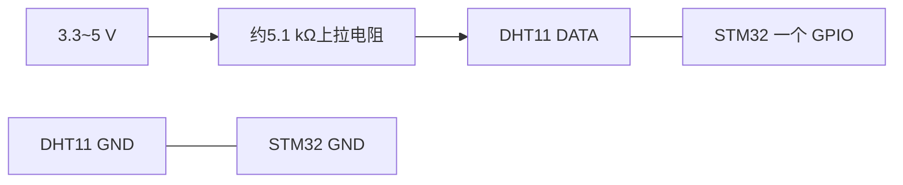
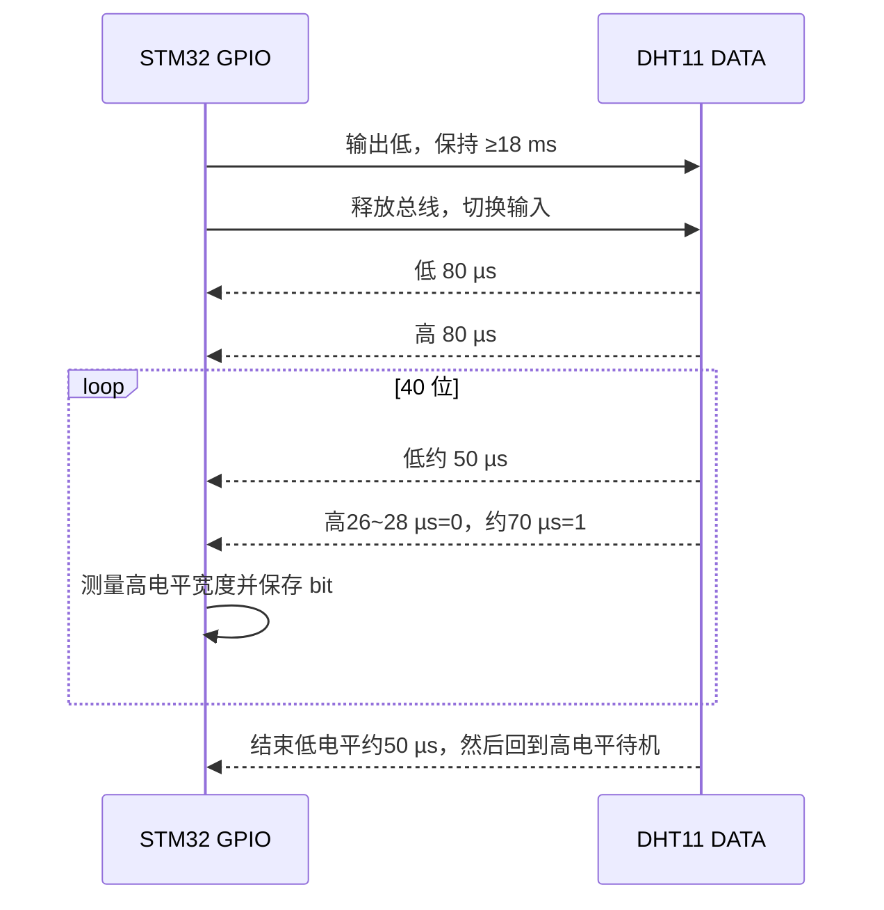

# DHT11 读写时序与通信规则

本文只说明 STM32 与 DHT11 的单总线读写顺序、时间要求和 40 bit 数据规则。

## 1. 先完成硬件连接



DATA 总线空闲时为高电平。STM32 必须能够在“输出低电平”和“输入/释放总线”之间切换；如果使用 DHT11 模块，先确认模块是否已经自带上拉电阻。

## 2. 一次完整读取的严格顺序

1. 上电后等待至少约 2 秒。
2. DATA 保持高电平空闲。
3. STM32 将 DATA 配置为输出并拉低，保持 **至少 18 ms**。
4. STM32 释放 DATA，改为输入或开漏高阻，等待约 20～40 µs。
5. DHT11 应答：先拉低约 80 µs，再拉高约 80 µs。
6. STM32 接收 40 位数据。每一位先是约 50 µs 低电平，再根据高电平持续时间判断 0 或 1：
   - 高电平约 26～28 µs：`0`
   - 高电平约 70 µs：`1`
7. 按 MSB 先接收，得到 5 个字节。
8. 检查校验和；校验失败就丢弃本次数据，不更新温湿度显示。
9. 最后一位结束后，DHT11 会将总线拉低约 50 µs，随后释放为高电平待机。
10. 两次完整采样之间至少间隔 2 秒，再从第 3 步开始。

## 3. DHT11 时序图

```text
总线空闲       MCU起始信号                  DHT11应答             40 bit 数据
高 ────────────┐                           ┌────80us高────┐   ┌─50us─┐ ┌─高─┐
               │                           │              │   │      │ │    │
低              └──── 至少18ms低 ─ 释放 ────┘ 80us低        └───┘      └─...
                                      ↑
                                    等20~40us

每一位：
0：低约50us ─ 高约26~28us
1：低约50us ─ 高约70us
```



## 4. 40 bit 数据排列

```text
byte0：湿度整数 RH_int
byte1：湿度小数 RH_dec（DHT11 通常为 0）
byte2：温度整数 T_int
byte3：温度小数 T_dec（DHT11 通常为 0）
byte4：校验和
```

校验和规则：

```text
checksum = (byte0 + byte1 + byte2 + byte3) & 0xFF
```

只有 `checksum == byte4` 时，本次数据才有效。例如湿度 60、温度 25 时，前四字节为 `60、0、25、0`，校验和为 `85`。

## 5. STM32 接收 1 bit 的顺序

对 40 个 bit 重复以下动作：

1. 等待 DHT11 将 DATA 拉低。
2. 等待约 50 µs 低电平结束。
3. 记录高电平开始时间。
4. 等待高电平结束并测量持续时间。
5. 高电平约 26～28 µs 记为 0；约 70 µs 记为 1。
6. 按先收到的 bit 放入高位，连续组成 5 个字节。

建议使用微秒定时器或输入捕获，避免一次采样过程中被长时间中断打断。

## 6. DHT11 读取失败时优先检查

- GPIO 是否从输出低正确切换为输入/高阻，不能一直由 STM32 推挽输出。
- DATA 是否有约 5.1 kΩ 上拉电阻，线路是否过长。
- 起始低电平是否达到 18 ms，释放后是否等待 20～40 µs。
- 是否按“每位先等约 50 µs 低，再测高电平宽度”的方式采样。
- 两次采样是否间隔至少 2 秒，上电后是否等待约 1 秒。
- 如果 DATA 始终为高，先检查供电、共地、DATA 连接和上拉电阻。

## 7. 资料来源

- [奥松电子 DHT11 产品手册（官方）](https://www.aosong.com/userfiles/files/media/DHT11-V1_3%E8%AF%B4%E6%98%8E%E4%B9%A6%EF%BC%88%E8%AF%A6%E7%BB%86%E7%89%88%EF%BC%89.pdf)
- [DHT11 立创商城资料页（用户提供）](https://item.szlcsc.com/datasheet/DHT11/118309.html)
- [DHT11 数据手册公开镜像](https://www.digikey.com/htmldatasheets/production/2071184/0/0/1/dht11-humidity-temp-sensor.html)
