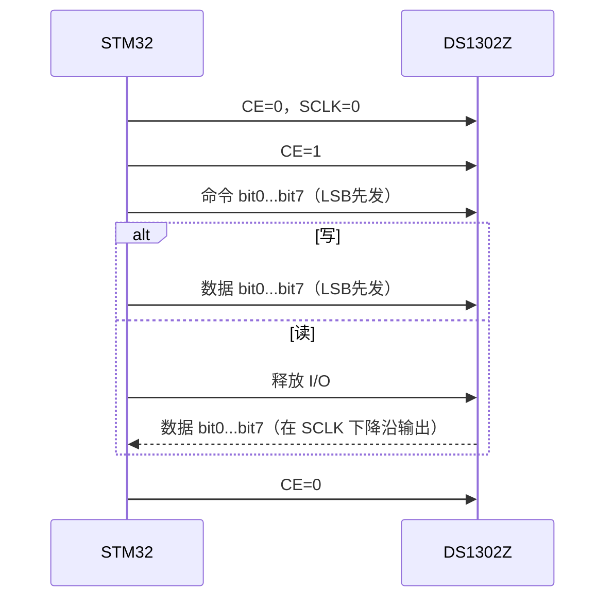

# DS1302Z 读写时序与通信规则

本文只说明 STM32 与 DS1302Z 通信时应该“先做什么、再做什么”。DS1302Z 市面上有国产兼容/替代型号；如果手上芯片的 PDF 对电压或时序给出了更严格的数值，以具体型号手册为准。

## 1. 先完成硬件连接

| DS1302Z 引脚 | 作用 | STM32 侧 |
|---|---|---|
| VCC2 | 主电源 | 接系统电源 |
| VCC1 | 备用电源 | 接纽扣电池或备用电源 |
| X1、X2 | 32.768 kHz 晶振 | 接 32.768 kHz 晶体，推荐负载电容 6 pF |
| GND | 地 | 与 STM32 共地 |
| CE（旧资料也写 RST） | 片选/传输使能 | GPIO 输出 |
| SCLK | 串行时钟 | GPIO 输出 |
| I/O | 双向数据 | GPIO 输出/输入切换 |

DS1302Z 使用 CE、SCLK、I/O 三根信号线。CE 拉高才允许通信；CE 拉低会结束通信，I/O 回到高阻态。CE 拉高前，SCLK 必须先为低电平。

## 2. 每次读写的固定顺序

```text
1. CE=0，SCLK=0
2. 准备命令字
3. CE=1
4. 命令字按 bit0 → bit7 发送（LSB 先发）
5. 写操作：继续发送数据；读操作：释放 I/O 后接收数据
6. CE=0，结束访问
```



## 3. 命令字规则

```text
bit7     bit6          bit5..bit1       bit0
必须为1  0=时钟/日历   寄存器地址A4..A0  0=写，1=读
         1=RAM
```

命令字虽然按 bit7..bit0 表示，但实际发送顺序是 bit0、bit1……bit7。

### 3.1 RTC 寄存器命令

| 数据 | 写命令 | 读命令 | 说明 |
|---|---:|---:|---|
| 秒 | `0x80` | `0x81` | bit7 是 CH，必须写 0 才运行 |
| 分 | `0x82` | `0x83` | BCD，00～59 |
| 时 | `0x84` | `0x85` | 推荐 24 小时制，00～23 |
| 日 | `0x86` | `0x87` | 1～31 |
| 月 | `0x88` | `0x89` | 1～12 |
| 星期 | `0x8A` | `0x8B` | 1～7，具体星期含义由用户定义 |
| 年 | `0x8C` | `0x8D` | 00～99 |
| 控制 | `0x8E` | `0x8F` | bit7 是 WP |
| 时钟突发 | `0xBE` | `0xBF` | 连续访问前 8 个时钟/日历寄存器 |

RAM 地址从写 `0xC0`、读 `0xC1` 开始，每个地址递增 2；RAM 突发命令为写 `0xFE`、读 `0xFF`。

## 4. 第一次设置时间的先后顺序

1. CE=0、SCLK=0。
2. 读取控制寄存器 `0x8F`，确认 WP（写保护）状态。
3. 如果 WP=1，执行：CE=1 → 发送 `0x8E` → 发送 `0x00` → CE=0。
4. 把十进制时间转换成 BCD。例如 25 分钟应写 `0x25`，不是二进制数值 25。
5. 写秒寄存器 `0x80`，CH 位写 0。例如 12 秒写 `0x12`。
6. 紧接着写分、时、日、月、星期、年。
7. 写控制寄存器 `0x8E` 的 `0x80`，重新打开 WP。

写入秒寄存器会重置内部计时链，秒写入后其余时间寄存器应尽快完成，避免跨秒造成不一致。

### 4.1 突发写时间

```text
CE=1 → 发 0xBE → 秒 → 分 → 时 → 日 → 月 → 星期 → 年 → 控制 → CE=0
```

突发写必须从秒开始，连续写完前 8 个时钟/日历寄存器；WP=1 时突发写不会生效，所以一定要先清除 WP。

## 5. 读取当前时间的先后顺序

### 5.1 单字节读取

以读取秒为例：

1. CE=0、SCLK=0。
2. CE=1。
3. 发送读命令 `0x81`，LSB 先发。
4. STM32 将 I/O 改为输入或高阻态。
5. 继续产生 8 个 SCLK 周期，在每个下降沿读取一位，按 bit0 到 bit7 组合成字节。
6. CE=0。
7. 将 BCD 转换为十进制：`十进制值 = (BCD >> 4) × 10 + (BCD & 0x0F)`。

### 5.2 突发读取完整时间

```text
CE=1 → 发 0xBF → 读秒、分、时、日、月、星期、年、控制 → CE=0
```

突发读会先把当前时间复制到内部用户缓冲区，再连续读出，适合一次读取完整日期时间。

## 6. DS1302Z 读写时序图

```text
写一个字节：数据在 SCLK 上升沿前准备好

CE    ____/‾‾‾‾‾‾‾‾‾‾‾‾‾‾‾‾‾‾‾‾‾‾‾‾‾\____
SCLK  ____/‾\_/‾\_/‾\_/‾\_ ... _/‾\_/‾\____
I/O   cmd bit0 ... bit7  data bit0 ... bit7
      ↑ 每一位按 bit0→bit7 发送

读一个字节：命令发送完后释放 I/O

CE    ____/‾‾‾‾‾‾‾‾‾‾‾‾‾‾‾‾‾‾‾‾‾‾‾‾‾\____
SCLK  ____/‾\_/‾\_/‾\_/‾\_ ... _/‾\_/‾\____
I/O   cmd bit0 ... bit7   Z  d0  d1 ... d7
                              ↓ 在下降沿输出/读取一位
```

## 7. 读写失败时优先检查

- SCLK 是否在 CE 拉高前已经为低。
- 命令和数据是否误按 MSB 先发。
- 读操作时 I/O 是否仍被 STM32 配置为推挽输出。
- 秒寄存器 CH 是否为 1。
- 控制寄存器 WP 是否为 1。
- X1/X2 是否接 32.768 kHz 晶体，VCC1/VCC2 和共地是否正确。
- 使用不可充电 CR2032 时不要随意开启 trickle charger。

## 8. 资料来源

- [DS1302/DS1302Z 官方数据手册（Analog Devices/Maxim）](https://www.analog.com/media/en/technical-documentation/data-sheets/DS1302.pdf)
- [DS1302Z 立创资料（用户提供）](https://atta.szlcsc.com/upload/public/pdf/source/20240105/2EECAA23DA6554B4727AEEBA1516F833.pdf)
