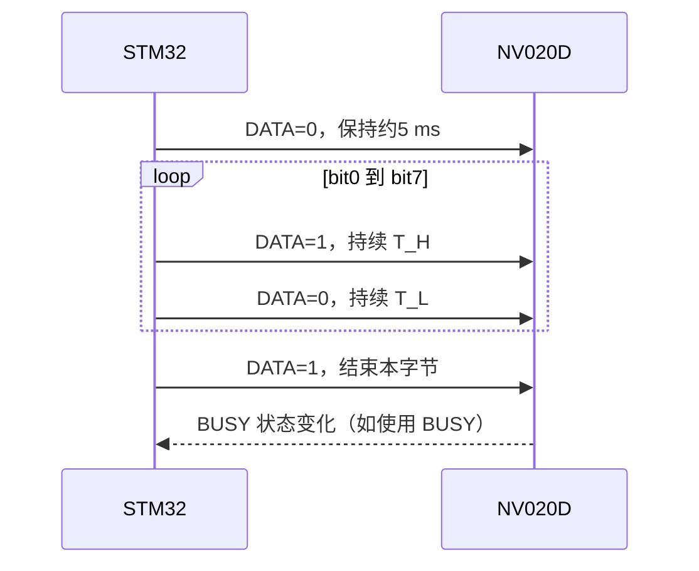
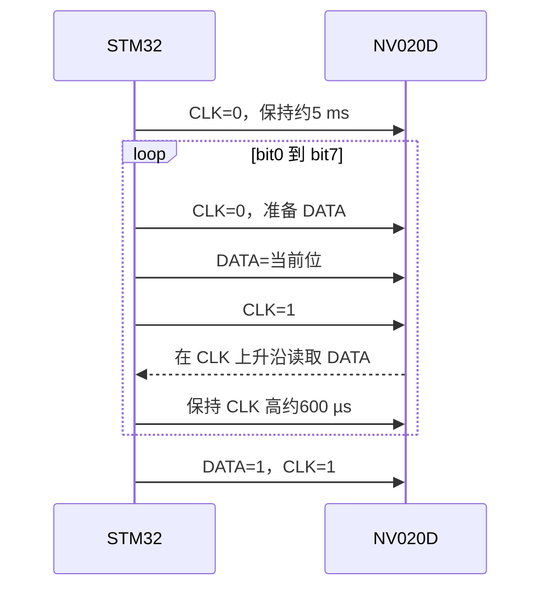

# NV020D 读写时序与通信规则

NV020D 是 NVD 系列语音芯片。这里的“读写”主要是 **STM32 向芯片发送播放、音量、循环、停止等控制命令**，不是 DS1302 那种可读回寄存器的双向读写。

## 1. 先确认芯片控制模式

NV020D 可配置为：

- MCU 一线串口模式：使用 `IOA2` 作为 DATA。
- MCU 二线串口模式：使用 `IOA2` 作为 CLK，`IOA3` 作为 DATA。
- 按键触发模式。

控制模式在出厂时配置，用户不能在同一颗芯片上同时使用一线和二线串口。因此，第一步要确认手上的 NV020D 是哪一种配置。

## 2. 上电和电气准备

1. `PVDD` 接芯片电源，`VSS1` 接地，STM32 与 NV020D 必须共地。
2. 电源附近放置去耦电容；语音输出端 `AUDP/AUDN` 接喇叭时，按手册的应用电路布线。
3. 上电后至少等待约 **200 ms** 再发送命令；为了兼容不同批次，建议等待 300～500 ms。
4. STM32 的高电平通信电压应满足：`U_MCU ≥ 0.7 × U_NV020D`。如果 STM32 为 3.3 V，NV020D 供电不要高于约 4.7 V，否则可能无法识别。
5. 一线串口的 DATA、二线串口的 CLK/DATA 在未发送时保持高电平。

## 3. SOP-8 引脚

| 引脚 | 名称 | 一线串口 | 二线串口 |
|---:|---|---|---|
| 1 | IOH3/VPP | 普通 I/O/编程脚，通信时通常不用 | 普通 I/O/编程脚，通信时通常不用 |
| 2 | IOA1 | BUSY 忙信号输出 | BUSY 忙信号输出 |
| 3 | IOA2 | DATA 输入 | CLK 输入 |
| 4 | IOA3 | 未使用 | DATA 输入 |
| 5 | PVDD | 电源输入 | 电源输入 |
| 6 | AUDP | PWM 喇叭输出 | PWM 喇叭输出 |
| 7 | AUDN | PWM 喇叭输出 | PWM 喇叭输出 |
| 8 | VSS1 | 地 | 地 |

BUSY 是语音播放忙信号，通常只作为状态输入使用；如果不使用 BUSY，可以不接，但要确保输入脚不会影响 DATA/CLK。

---

## 4. 一线串口时序

### 4.1 一线串口发送顺序

1. 将 `IOA2/DATA` 拉低约 **5 ms**。手册给出的开始码范围约为 3～9 ms。
2. 发送 8 位命令，**低位先发**，即 bit0 → bit7。
3. 每一位先输出高电平，再输出低电平；高低电平的时间比例决定 0 或 1。
4. 8 位发送完成后，DATA 拉回高电平待机。



### 4.2 一线串口的 0/1 时序

| 数据位 | 高电平时间 | 低电平时间 | 推荐值 |
|---|---:|---:|---:|
| `0` | `T0H` 约 400 µs | `T0L` 约 1200 µs | 400 µs + 1200 µs |
| `1` | `T1H` 约 1200 µs | `T1L` 约 400 µs | 1200 µs + 400 µs |

手册给出的可用范围约为：

- `0`：高 300～8000 µs，低 600～9000 µs。
- `1`：高 600～9000 µs，低 300～8000 µs。

工程中优先使用推荐值 `400 µs / 1200 µs`，不要在同一字节内随意改变比例。

```text
DATA 空闲：高

起始码：    ────────────────┐
DATA       高              └──── 低约5ms ────┐
                                             └─开始发送 bit0

bit=0：    ┌─高400us─┐                 ┌─高400us─┐
DATA       │         └─低1200us────────┘         └─...

bit=1：    ┌────高1200us────┐           ┌────高1200us────┐
DATA       │                └─低400us───┘                └─...
```

### 4.3 一线串口单码

单码用于直接播放一段语音、调节音量、循环或停止：

```text
DATA低5ms → 发送1个字节（bit0先发）→ DATA恢复高电平
```

单码示例：

- 发送 `00H`：播放第 1 段语音。
- 发送 `01H`：播放第 2 段语音。
- 发送 `E0H`～`E7H`：设置 8 级音量，E0 最小、E7 最大。
- 发送 `F2H`：循环当前语音。
- 发送 `FEH`：停止所有语音。

### 4.4 一线串口连码

连码用于连续播放多段语音或插入静音，数据结构为：

```text
[F1H] + [语音地址1] + [语音地址2] + ... + [F3H] + [校验和]
```

其中：

- `F1H`：连码头码。
- `F3H`：连码尾码。
- `F4H`：静音命令，后面再跟 1 个字节，静音时间 = 字节值 × 10 ms。
- 校验和 = 连码中所有字节相加后的低 8 位，包含 `F1H`、`F3H`、`F4H` 和静音参数。
- 连码一次最多发送 29 个字节。
- 一帧连码只发送一次起始低电平，后续字节直接连续发送。

例如：

```text
F1 01 02 F4 0A 03 F3 E8
```

含义是播放第 2 段、播放第 3 段、静音 100 ms、播放第 4 段；`E8` 是前面所有字节相加后的低 8 位。

同一连码中的字节要尽量连续发送。旧版资料允许字节间隔不超过 50 ms，新版手册要求连码帧间隔小于 500 µs；为提高兼容性，建议同一连码内字节间隔控制在 500 µs 以内。单码和下一帧之间建议至少间隔 5～10 ms。

---

## 5. 二线串口时序

### 5.1 二线串口引脚

- `IOA2/CLK`：时钟输入。
- `IOA3/DATA`：数据输入。
- `IOA1/BUSY`：忙信号输出。

### 5.2 二线串口发送顺序

1. 将 `CLK` 拉低约 **5 ms**，唤醒芯片；开始码范围约为 3～10 ms。
2. 对每个字节，从 bit0 到 bit7 发送。
3. 每一位先让 CLK 为低，再准备 DATA。
4. 将 CLK 拉高，芯片在 **CLK 上升沿**读取 DATA。
5. 保持 CLK 高电平一段时间，再进入下一位。
6. 8 位发送完成后，DATA 和 CLK 恢复高电平。



### 5.3 二线串口单 bit 的推荐时间

手册推荐 CLK 脉冲时间约 600 µs，范围约 200～6000 µs。参考发送动作可以写成：

```text
CLK=0，延时约300us
设置 DATA 为当前 bit
CLK=1，延时约600us（芯片在上升沿取数）
下一个 bit
```

数据同样是 **低位先发**。二线串口和一线串口使用相同的命令字及连码格式。

### 5.4 二线串口连续发送

- 单码和连码的命令规则与一线串口相同。
- 连码一次最多 29 个字节。
- 连码校验和仍为所有字节相加后的低 8 位。
- 多条指令连续发送时，检测到 BUSY 释放后，建议再延时 50～100 ms，避免芯片内部处理尚未完成。

---

## 6. BUSY 和音频输出时序

按新版 NVD 手册的典型值：

- 一线串口：发码结束后约 11 ms，BUSY 开始响应；BUSY 响应后约 1 ms，音频输出开始。
- 二线串口：发码结束后约 5 ms，BUSY 开始响应；BUSY 响应后约 5 ms，音频输出开始。

BUSY 的具体有效电平可能与出厂配置或模块电路有关。调试时建议先用逻辑分析仪观察 `IOA1`：确认“空闲电平、播放电平、发码后响应时间”，再决定程序是等待 BUSY 还是使用固定延时。

## 7. STM32 实现的建议先后顺序

1. 初始化一个微秒级定时器。
2. 配置 DATA/CLK 为推挽输出，空闲置高；BUSY 配置为输入。
3. 上电等待 200～500 ms。
4. 确认芯片出厂控制模式。
5. 先只发送 `00H`，验证第 1 段语音能播放。
6. 再验证 `E0H`～`E7H` 音量命令和 `FEH` 停止命令。
7. 最后验证 `F1H...F3H+校验和` 连码。
8. 用逻辑分析仪确认：起始低电平、bit0 先发、0/1 高低电平比例、BUSY 响应。

## 8. 常见问题

- 一线和二线串口不能同时使用，先确认出厂配置。
- DATA/CLK 空闲必须为高电平，不能在发送结束后保持低电平。
- 命令和语音地址都是低位先发。
- 一线串口不是普通 UART，不要配置成固定波特率串口发送。
- 3.3 V MCU 驱动较高电压 NV020D 时，先检查 `U_MCU ≥ 0.7×U_NV020D`。
- 连码校验和要包含 `F1H`、`F3H`、`F4H` 以及静音参数。
- 如果完全没有声音，先查芯片是否仍在上电初始化、DATA/CLK 接脚是否和模式匹配、BUSY 是否只是被误判。

## 9. 资料来源

- [NV020D 立创商城资料页（用户提供）](https://item.szlcsc.com/datasheet/NV020D/3259133.html)
- [九芯电子 NVD 系列数据手册 V1.24](https://www.n-ec.cn/static/upload/file/20221103/1667467820537681.pdf)
- [九芯电子 NVD 系列数据手册 V2.00](https://www.9xdz.com/static/upload/file/20231009/1696819778652237.pdf)
